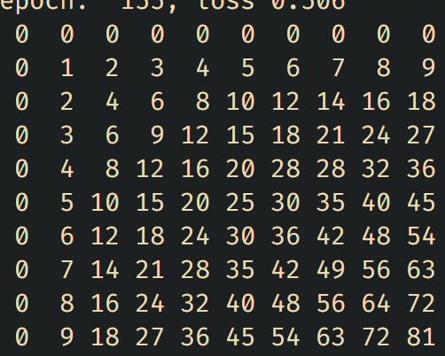

# <span style="font-family:Papyrus"> Java Poštevanka </span>

Moj prvi program v jeziku Java :D.

Implementacija metode, opisane v Fürst in sod. [1].

## Namen

Program izpiše poravnano tabelo zmnožkov celih števil med 0 in 9 (omejitev standardnega terminala).

Program ne potrebuje zunanjih knjižnic (!).

## Uporaba

Navodila za uspešno uporabo programa:

1) Uporabnik prenese repozitorij na lokalni računalnik z nameščenim JDK.

2) Uporabnik natipka in požene sledeči ukaz v terminal, odprt v korenskem imeniku repozitorija:
```
javac JavaPostevanka/Postevanka.java && java JavaPostevanka.Postevanka
```

3) Uporabnik si skuha kavo in počaka, da se GPT "nauči" zmnožkov.

4) ???

5) Uporabnik uživa v izpisani poštevanki.

<br>
<br>



Figura 1. Primer izpisane poštevanke.

## Struktura projekta

Mapa `assets` vsebuje vizualne elemente trenutnega dokumenta.

Mapa `JavaPostevanka` vsebuje izvorno kodo programa.

## Literatura

[1] Fürst, Luka (2023). Java od začetka. URN:NBN:SI:DOC-BJCZNM22 from http://www.dlib.si
